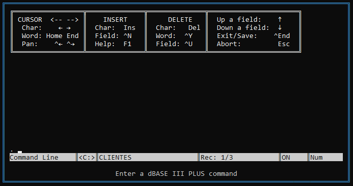

)

# 🧠 dBase Dinâmico (Simulador Lógico)

Este projeto é um **simulador do ambiente dBase**, implementado com **listas encadeadas dinâmicas**, como parte do trabalho da disciplina **Estruturas de Dados II** (FIPP – Unoeste). Ele simula o comportamento de arquivos `.DBF`, mas **não cria arquivos reais no disco** — tudo é realizado logicamente em memória, utilizando estruturas de dados.

## 📌 Objetivo

Simular o funcionamento de um sistema semelhante ao dBase clássico (anos 80/90), manipulando registros e estruturas de arquivos `.DBF` com operações como criação, listagem, exclusão lógica/física, localização e edição de registros, entre outras.

## ⚙️ Funcionalidades Implementadas

- `SET DEFAULT TO`: Seleciona unidade lógica (`D:` ou `C:`)
- `CREATE`: Cria um arquivo `.DBF` (em memória)
- `DIR`: Lista os arquivos criados na unidade atual
- `USE`: Abre um arquivo
- `LIST STRUCTURE`: Mostra os campos da estrutura do arquivo
- `APPEND`: Insere novos registros no arquivo `.DBF`
- `LIST`: Lista os registros com filtros opcionais
- `LOCATE`: Busca registros com base em condições
- `GOTO`, `DISPLAY`, `EDIT`: Navegação e edição de registros
- `DELETE`, `RECALL`, `PACK`, `ZAP`: Exclusão lógica/física de registros
- `CLEAR`, `QUIT`, `SET DELETED ON/OFF`: Comandos auxiliares
- Comandos extras como `MODIFY STRUCTURE` e `SORT` também foram adicionados

## 📁 Observação Importante

> ⚠️ Este projeto **não gera arquivos `.DBF` reais**.  
> Toda a lógica é baseada em estruturas de dados na memória, especialmente **listas encadeadas dinâmicas**, simulando o comportamento do dBase clássico de forma educativa.

## 🧰 Tecnologias e Estruturas

- Linguagem: **C** (ou [adicione a linguagem correta se for diferente])
- Uso de `struct`, `union` e ponteiros para representar arquivos, campos e registros
- Simulação de tipos: `N` (Numeric), `C` (Character), `L` (Logical), `D` (Date), `M` (Memo)

## 📷 Interface

A interface do sistema é textual e interativa, inspirada na linha de comando do dBase. O usuário digita os comandos como faria no dBase original, e o sistema interpreta e executa conforme a sintaxe correta.

## 🎓 Sobre

Projeto desenvolvido por **Mateus Silva Maciel** e **Lucas Ataide Malagueta** para a disciplina de **Estruturas de Dados II** — 1º Bimestre de 2025  
**Professor:** Francisco Assis da Silva  
**Curso:** Sistemas de Informação – FIPP/UNOESTE

---